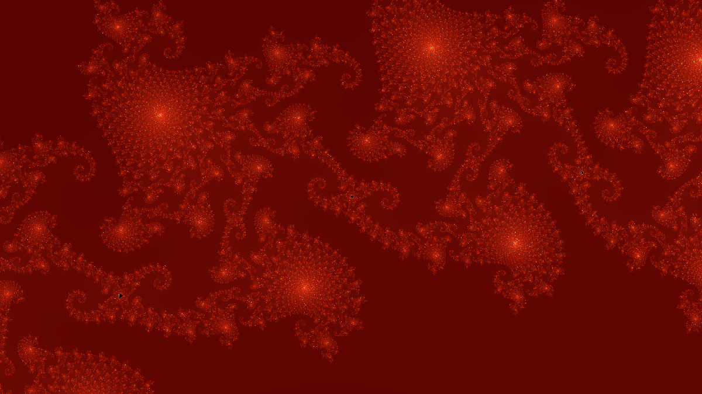
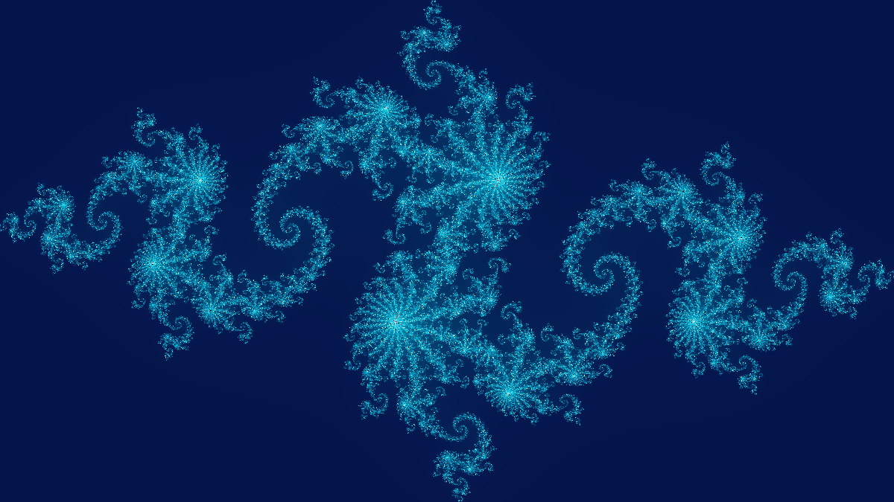

# Fractal CLI

Native AOT .NET command-line fractal renderer for Mandelbrot and Julia sets.

This project intentionally pins SixLabors.ImageSharp to version 3.1.12 and does not use ImageSharp 4.x.

## Features

- Mandelbrot PNG rendering
- Julia PNG rendering
- CLI zoom support
- Custom width and height
- Multiple palettes
- Native AOT publish support
- Uses SixLabors.ImageSharp 3.x

## Install from source

```bash
git clone https://github.com/andrii2g/fractal-cli.git
cd fractal-cli
dotnet restore
dotnet build
```

## Usage

```bash
dotnet run --project src/FractalCli -- render mandelbrot --output samples/generated/mandelbrot.png
```

After publishing, use the executable directly:

```bash
fractal render mandelbrot --output mandelbrot.png
```

## Algorithms

This renderer uses the escape-time algorithm for quadratic complex maps, with direct pixel-to-complex-plane viewport mapping and iteration-count coloring.

See [Algorithm Notes](docs/ALGORITHMS.md) for the formulas, implementation choices, and reference links.

## Examples

### Featured Mandelbrot zoom



```bash
fractal render mandelbrot \
  --output samples/mandelbrot-seahorse-fire.png \
  --width 1200 \
  --height 675 \
  --center-x -0.743643887037151 \
  --center-y 0.13182590420533 \
  --scale 0.0008 \
  --max-iterations 1200 \
  --palette fire
```

### Featured Julia set



```bash
fractal render julia \
  --output samples/julia-ice.png \
  --width 1200 \
  --height 675 \
  --center-x 0 \
  --center-y 0 \
  --scale 3.0 \
  --julia-cx -0.8 \
  --julia-cy 0.156 \
  --max-iterations 800 \
  --palette ice
```

### Basic Mandelbrot

```bash
fractal render mandelbrot --output samples/generated/mandelbrot.png
```

### Mandelbrot zoom

```bash
fractal render mandelbrot \
  --output samples/generated/mandelbrot-seahorse.png \
  --width 1920 \
  --height 1080 \
  --center-x -0.743643887037151 \
  --center-y 0.13182590420533 \
  --scale 0.0008 \
  --max-iterations 1200 \
  --palette fire
```

### Basic Julia

```bash
fractal render julia \
  --output samples/generated/julia.png \
  --width 1600 \
  --height 1200 \
  --julia-cx -0.8 \
  --julia-cy 0.156 \
  --palette ice
```

### Deep Mandelbrot detail

```bash
fractal render mandelbrot \
  --output samples/generated/mandelbrot-deep.png \
  --width 2400 \
  --height 1600 \
  --center-x -0.743643135 \
  --center-y 0.131825963 \
  --scale 0.00002 \
  --max-iterations 3000 \
  --palette classic
```
